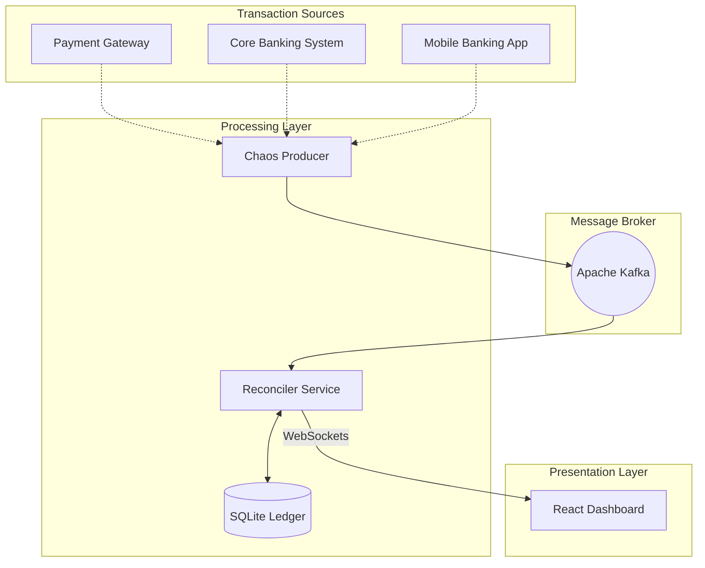

# 🏦 Real-Time 3-Way Transaction Reconciliation Engine

> A production-grade, fault-tolerant financial ledger system that performs **3-way reconciliation** across Payment Gateway, Core Banking System, and Mobile Banking platforms. Detects transaction anomalies, data loss, and mismatches in real-time using Apache Kafka, Python, and WebSockets.


## 📸 Screenshots

<p align="center">
  
</p>

## 📖 Overview

In modern banking, transactions traverse multiple distributed systems (Payment Gateways, Core Banking Systems, Mobile Apps). Network failures, bugs, or malicious activity can cause these ledgers to drift out of sync, leading to financial discrepancies.

This project implements a **Real-Time 3-Way Reconciliation Engine** that:

| Feature                    | Description                                                     |
| -------------------------- | --------------------------------------------------------------- |
| 🔄 **3-Way Matching**      | Compares transactions across PG, CBS, and Mobile Banking        |
| 🎭 **Chaos Engineering**   | Simulates real-world failures with controllable chaos injection |
| 🤖 **AI Analysis**         | Smart anomaly detection with risk scoring (0-100)               |
| ⚡ **Auto-Mitigation**     | Automatically resolves discrepancies using consensus voting     |
| 🇮🇳 **Indian Banking**      | INR formatting (Lakhs/Crores), UPI, Indian banks support        |
| 📊 **Real-time Dashboard** | Live heatmaps, geo-risk analysis, WebSocket alerts              |
| 🔊 **Audio Alerts**        | Sound notifications for critical mismatches                     |

---

## 🏗️ Architecture

The system follows a decoupled microservices architecture with 3 data sources:



### Data Flow

1. **Chaos Producer** generates mock INR transactions with configurable chaos rate
2. Transactions are published to 3 Kafka topics: `pg-transactions`, `cbs-transactions`, `mobile-transactions`
3. **Reconciler Service** consumes messages, stores in SQLite, and performs 3-way matching
4. Mismatches trigger WebSocket alerts with AI analysis and risk scores
5. **React Dashboard** displays real-time visualizations and controls

---

## 🚀 Quick Start

### Prerequisites

- Python 3.9+
- Node.js 18+
- Docker (for Kafka)

### 1. Start Apache Kafka

```bash
# Using Docker Compose (Recommended)
docker-compose up -d

# OR using standalone Docker
docker run --name kafka-broker -d -p 9092:9092 apache/kafka:4.1.1

---

## ☁️ Phase 1: Run on Azure Event Hubs (Kafka API)

This project can run on **Azure Event Hubs using the Kafka protocol** with minimal code changes (env-only).

### Azure setup (one-time)

1. Create an **Event Hubs namespace** (Standard is fine for MVP).
2. Enable the **Kafka endpoint**.
3. Create Event Hubs (or reuse one per topic) for:
    - `pg-transactions`
    - `cbs-transactions`
    - `mobile-transactions`

### Local run (no Docker Kafka required)

Recommended: create a local `backend/.env` file (see `backend/.env.example`) so you don’t have to re-set PowerShell variables every run.

Typical values:

- `KAFKA_BOOTSTRAP_SERVERS=<namespace>.servicebus.windows.net:9093`
- `KAFKA_SECURITY_PROTOCOL=SASL_SSL`
- `KAFKA_SASL_MECHANISM=PLAIN`
- `KAFKA_SASL_USERNAME=$ConnectionString`
- `KAFKA_SASL_PASSWORD=<Event Hubs connection string>`

Then start the backend services exactly the same way.

---

## 🤖 Phase 2: Enable Azure AI Foundry Explanations (Responses API)

When Azure AI Foundry is configured, the reconciler generates **JSON-schema-validated explanations** for mismatches and missing-counterparty events and attaches them to:

- live WebSocket alerts (`ai` field)
- `GET /api/transaction/:id` (`ai_insight` field)

### Azure setup (one-time)

1. Create or open your **Azure AI Foundry** project/resource.
2. Create a **deployment** (this system uses deployment-backed inference, not raw model names).
3. Copy:
    - the **Endpoint** (looks like `https://<something>.services.ai.azure.com`)
    - an **API Key**
    - the **Deployment name**

### Local configuration

Set these environment variables (or add them to `backend/.env`):

- `AZURE_FOUNDRY_ENDPOINT=https://recon-gpt.services.ai.azure.com`
- `AZURE_FOUNDRY_API_KEY=<foundry-key>`
- `AZURE_FOUNDRY_DEPLOYMENT=<deployment-name>`

Optional:

- (no additional AI env vars; the system reads only AZURE_FOUNDRY_ENDPOINT / AZURE_FOUNDRY_API_KEY / AZURE_FOUNDRY_DEPLOYMENT)

---

## 🛡️ Phase 3: Add Azure AI Content Safety Guardrails (Required for AI Explanations)

Imagine Cup requires **at least two Microsoft AI services**. This project uses:

- **Azure AI Foundry** (model inference via Responses API)
- **Azure AI Content Safety** (text safety checks on AI-generated explanations)

When enabled, every AI explanation is analyzed by Content Safety before being stored or sent to the dashboard.

### Azure setup (one-time)

1. Create an **Azure AI Content Safety** resource.
2. Copy the **Endpoint** and an **API Key**.

### Local configuration

Set these environment variables (or add them to `backend/.env`):

- `AZURE_CONTENT_SAFETY_ENDPOINT=https://<resource>.cognitiveservices.azure.com`
- `AZURE_CONTENT_SAFETY_API_KEY=<content-safety-key>`

Optional:

- `CONTENT_SAFETY_SEVERITY_THRESHOLD=4` (block if any category severity >= threshold)

### Imagine Cup strict mode (optional)

To make the MVP demo clearly show that the system **requires** both AI services, you can enable:

- `IC_REQUIRE_AI_SERVICES=1`

When this is set, the backend will refuse to start unless both Azure AI Foundry and Azure AI Content Safety are configured.
```

### 2. Create Kafka Topics

```bash
# If using docker-compose, skip this step (topics auto-created)
# If using standalone Docker:
docker exec -it kafka-broker /opt/kafka/bin/kafka-topics.sh --create --topic pg-transactions --bootstrap-server localhost:9092
docker exec -it kafka-broker /opt/kafka/bin/kafka-topics.sh --create --topic cbs-transactions --bootstrap-server localhost:9092
docker exec -it kafka-broker /opt/kafka/bin/kafka-topics.sh --create --topic mobile-transactions --bootstrap-server localhost:9092
```

### 3. Start Backend Services

```bash
# Terminal 1: Setup & Start Reconciler
cd backend
pip install -r requirements.txt
python reconciler_service.py
```

```bash
# Terminal 2: Start Chaos Producer (Transaction Generator)
cd backend
python chaos_producer.py
```

### 4. Start Frontend Dashboard

```bash
# Terminal 3: React Dashboard
cd frontend
npm install
npm start
```

🎉 **Open http://localhost:3000** and login with:

- **Username:** `admin`
- **Password:** `securePass123!`

---

## 🎮 Dashboard Features

### Control Panel

- **Start/Pause Generator**: Control the chaos producer from the UI
- **Speed Control**: Adjust transaction velocity (0.5x - 10x)
- **Chaos Rate**: Set percentage of transactions with issues (0-100%)

### Visualizations

| Widget                | Description                                      |
| --------------------- | ------------------------------------------------ |
| 📊 **Heatmap**        | Day × Hour matrix showing mismatch concentration |
| 🌍 **Geo Risk**       | Country-wise transaction risk analysis           |
| 🥧 **Mismatch Types** | Pie chart breakdown of issue categories          |
| 📈 **Velocity Chart** | Real-time TPS with risk overlay                  |
| 🔔 **Live Feed**      | Streaming incident notifications                 |

### Transaction Deep Dive

Click any transaction to see a 3-way comparison showing:

- Payment Gateway data
- Core Banking System data
- Mobile Banking data
- Detected discrepancies with severity levels

---

## 🧪 Chaos Types

The chaos producer injects various failure scenarios:

| Type              | Description                          | Risk Level  |
| ----------------- | ------------------------------------ | ----------- |
| `MISSING_CBS`     | Transaction vanishes in Core Banking | 🔴 High     |
| `MISSING_MOBILE`  | Transaction not synced to Mobile App | 🟡 Medium   |
| `AMOUNT_MISMATCH` | Different amounts across systems     | 🔴 High     |
| `STATUS_MISMATCH` | Conflicting transaction states       | 🟡 Medium   |
| `FRAUD_ATTEMPT`   | Massive amount discrepancy (50-200x) | 🔴 Critical |
| `TIMESTAMP_DRIFT` | Significant time differences         | 🟢 Low      |
| `TRIPLE_MISMATCH` | All 3 sources disagree               | 🔴 Critical |

---

## 🤖 Auto-Mitigation

When enabled, the system automatically resolves issues using:

1. **Consensus Voting**: If 2 of 3 sources agree, use that value
2. **Source Priority**: PG is trusted for status, consensus for amounts
3. **Replay**: Re-inject missing transactions to affected systems

---

## 📡 API Endpoints

### Authentication

```http
POST /api/login
Content-Type: application/json
{"username": "admin", "password": "securePass123!"}
```

### Protected Endpoints (Require Bearer Token)

| Method | Endpoint               | Description              |
| ------ | ---------------------- | ------------------------ |
| GET    | `/api/stats`           | System statistics        |
| GET    | `/api/heatmap`         | Mismatch heatmap data    |
| GET    | `/api/geo-risk`        | Geographic risk analysis |
| GET    | `/api/mismatch-types`  | Breakdown by type        |
| GET    | `/api/transaction/:id` | Transaction details      |
| POST   | `/api/resolve`         | Manual resolution        |
| GET    | `/api/export`          | Download CSV report      |

### Chaos Control (No Auth Required)

| Method | Endpoint            | Description            |
| ------ | ------------------- | ---------------------- |
| GET    | `/api/chaos/status` | Current chaos settings |
| POST   | `/api/chaos/start`  | Start generator        |
| POST   | `/api/chaos/stop`   | Pause generator        |
| POST   | `/api/chaos/speed`  | Update speed/rate      |

---

## 🛠️ Tech Stack

### Backend

- **Python 3.9+** - Core language
- **Flask** - REST API framework
- **Flask-SocketIO** - Real-time WebSocket communication
- **Kafka-Python** - Message broker client
- **SQLAlchemy** - ORM for SQLite database
- **PyJWT** - Authentication tokens
- **Faker** - Indian transaction data generation

### Frontend

- **React 19** - UI framework
- **Recharts** - Data visualization
- **Socket.io-client** - WebSocket client
- **Lucide React** - Icon library
- **Tailwind CSS** - Styling
- **Axios** - HTTP client

### Infrastructure

- **Apache Kafka** - Message broker
- **Docker** - Container orchestration
- **SQLite** - Lightweight database

---

## 📁 Project Structure

```
Reconciliation-Engine/
├── backend/
│   ├── reconciler_service.py   # Main API & Kafka consumer
│   ├── chaos_producer.py       # Transaction generator
│   └── requirements.txt        # Python dependencies
├── frontend/
│   ├── src/
│   │   ├── App.js              # Main dashboard component
│   │   ├── App.css             # Styles
│   │   └── index.js            # Entry point
│   └── package.json            # Node dependencies
├── docker-compose.yml          # Kafka setup
└── README.md                   # This file
```

---

## 🔒 Security Notes

- JWT tokens expire after 24 hours
- Chaos control endpoints intentionally unauthenticated for demo purposes
- In production: Add proper auth, HTTPS, and rate limiting

---

## 🤝 Contributing

1. Fork the repository
2. Create a feature branch (`git checkout -b feature/amazing-feature`)
3. Commit changes (`git commit -m 'Add amazing feature'`)
4. Push to branch (`git push origin feature/amazing-feature`)
5. Open a Pull Request

---

## 📄 License

This project is licensed under the MIT License - see the [LICENSE](LICENSE) file for details.

---

## 👨‍💻 Authors

Built with ❤️ for the fintech community.

---

<p align="center">
  <b>⭐ Star this repo if you found it useful!</b>
</p>
