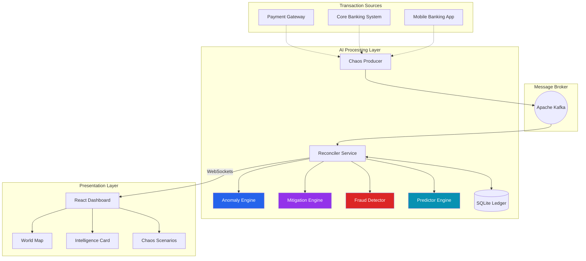

# 🧠 AI-Powered Real-Time Reconciliation Engine

> **ET Gen AI Hackathon 2026** — A self-learning, intelligent financial ledger system that performs **3-way reconciliation** with AI-driven auto-mitigation, fraud ring detection, predictive analytics, and real-time global transaction visualization.


---

## 🎯 What Makes This Special

This isn't just a reconciliation engine — it's an **AI-powered financial operations brain** that:

| Feature | Description | AI Component |
|---------|-------------|--------------|
| 🧠 **Self-Learning Mitigation** | Learns from human feedback to improve auto-resolution | Adaptive trust scoring with EMA |
| 🕵️ **Fraud Ring Detection** | Detects coordinated fraud attempts in real-time | Graph-based cycle & pattern detection |
| 🔮 **Predictive Analytics** | Forecasts transaction volumes and error rates | Time-series trend analysis |
| 🌍 **Live Global Map** | Visualizes transactions across 7 countries, 60+ cities | Real-time geospatial streaming |
| 🎭 **Advanced Chaos Scenarios** | 8 dramatic failure modes for demos | Coordinated failure injection |

---

## 📸 Key Features Overview

### 🧠 Intelligent Mitigation Engine

The system uses 5 different resolution strategies and **learns which one works best**:

```
┌─────────────────────────────────────────────────────────────────────┐
│                    MITIGATION STRATEGY SELECTION                     │
├─────────────────────────────────────────────────────────────────────┤
│  1. MAJORITY_VOTE      → 2-of-3 consensus                           │
│  2. TRUST_WEIGHTED     → Weighted by source reliability history     │
│  3. SOURCE_OF_TRUTH    → Single authoritative source (PG default)   │
│  4. TEMPORAL_CORRELATION → Use most recent data when timing matters │
│  5. HYBRID             → Combines multiple strategies contextually  │
├─────────────────────────────────────────────────────────────────────┤
│  Confidence Gates:                                                   │
│  • HIGH (>85%) confidence → Auto-resolve immediately                │
│  • MEDIUM (60-85%)        → Auto-resolve with monitoring            │
│  • LOW (<60%)             → Escalate to human operator              │
└─────────────────────────────────────────────────────────────────────┘
```

**Self-Learning Loop:**
1. System makes a resolution decision
2. Human operator confirms or overrides
3. Feedback adjusts source trust scores (EMA-based)
4. Future decisions improve automatically

### 🕵️ Fraud Ring Detection

Real-time graph analysis detects:

- **Cycle Detection** — Money going in circles (A → B → C → A = money laundering pattern)
- **Burst Detection** — Sudden spike from connected accounts
- **Coordinated Timing** — Multiple accounts transacting simultaneously
- **Layering Detection** — Complex chains to obscure money flow

```python
# Example: Detected fraud ring
{
  "ring_id": "RING-1770474896-0001",
  "ring_type": "cycle",
  "accounts": ["ACC12345678", "ACC87654321", "ACC11223344"],
  "total_volume": 5250000.00,
  "risk_score": 87.5,
  "evidence": ["Cycle detected: ACC123 → ACC876 → ACC112 → ACC123"]
}
```

### 🔮 Predictive Analytics

Forecasts future system behavior:

| Metric | Horizon | What It Predicts |
|--------|---------|------------------|
| TPM (Transactions/Min) | 5m, 15m, 30m | Volume spikes before they happen |
| Error Rate | 5m, 15m, 30m | Degradation trends |
| Trend Direction | Real-time | Rising, Falling, or Stable |

**Actionable Insights Generated:**
- "Transaction volume expected to increase significantly → Scale resources proactively"
- "Error rate trending up - predicted 15.3% in 5 minutes → Investigate system health"

### 🌍 Live World Map

Real-time visualization of transactions across:

| Country | Cities | Currency |
|---------|--------|----------|
| 🇮🇳 India | Mumbai, Delhi, Bangalore, Chennai, +6 more | INR |
| 🇺🇸 USA | New York, LA, Chicago, Houston, +4 more | USD |
| 🇬🇧 UK | London, Manchester, Birmingham, +5 more | GBP |
| 🇩🇪 Germany | Berlin, Munich, Frankfurt, +5 more | EUR |
| 🇸🇬 Singapore | Central, Jurong, Woodlands, +4 more | SGD |
| 🇦🇪 UAE | Dubai, Abu Dhabi, Sharjah, +3 more | AED |
| 🇦🇺 Australia | Sydney, Melbourne, Brisbane, +4 more | AUD |

Markers are color-coded:
- 🟢 **Green** — Verified transaction
- 🟡 **Amber** — Mismatch detected
- 🔴 **Red** — Error/Fraud suspected

### 🎭 Advanced Chaos Scenarios

8 dramatic scenarios for demo presentations:

| Scenario | Icon | Description | Duration |
|----------|------|-------------|----------|
| CBS Outage | 💥 | Core Banking System goes dark | 30s |
| Mobile Outage | 📱 | Mobile app crashes globally | 25s |
| Network Partition | 🌐 | One region isolated from network | 40s |
| Gradual Degradation | 📉 | CBS accuracy slowly drifts | 60s |
| Fraud Ring Attack | 🕵️ | Coordinated fraud burst | 45s |
| Flash Crash | ⚡ | Massive volume spike with errors | 20s |
| Data Corruption | 🔥 | Random field corruption | 35s |
| Replay Attack | 🔁 | Duplicate transactions injected | 30s |

---

## 🏗️ Architecture



---

## 🚀 Quick Start

### Prerequisites

- Python 3.11+
- Node.js 18+
- Docker & Docker Compose

### 1. Start Infrastructure & Services

```bash
# Clone and navigate
cd Reconciliation-Engine

# Start all services (Kafka, Backend, Frontend)
docker compose up -d

# Verify all 4 containers are running
docker compose ps
```

Expected output:
```
NAME         STATUS
zookeeper    healthy
kafka        healthy
reconciler   running (port 5000)
dashboard    running (port 3000)
```

### 2. Start Chaos Producer (Outside Docker)

```bash
# In a separate terminal
cd backend
pip install -r requirements.txt
python chaos_producer.py
```

### 3. Access the Dashboard

🎉 **Open http://localhost:3000**

Login credentials:
- **Username:** `admin`
- **Password:** `securePass123!`

---

## 🎮 Demo Script for Hackathon

### Phase 1: Normal Operations (2 min)
1. Open dashboard, show live map with transactions flowing
2. Point out the AI Intelligence Summary card
3. Show trust scores adapting in real-time

### Phase 2: Trigger Chaos (3 min)
1. Go to Settings → Chaos Producer Control
2. Click **"CBS System Outage"** scenario
3. Watch the map light up with red markers
4. Show the Mitigation Engine handling failures
5. Point out fraud ring detection if triggered

### Phase 3: Show Intelligence (2 min)
1. Open Intelligence Card
2. Show how trust scores changed after the outage
3. Show predictions adjusting
4. Resolve a transaction manually → watch trust update

### Phase 4: Fraud Demo (2 min)
1. Trigger **"Fraud Ring Attack"** scenario
2. Watch graph engine detect the coordinated pattern
3. Show fraud ring alert with linked accounts

---

## 📡 API Endpoints

### Core APIs

| Method | Endpoint | Description |
|--------|----------|-------------|
| GET | `/api/health` | System health with AI engine status |
| GET | `/api/stats` | Transaction statistics |
| POST | `/api/resolve` | Resolve transaction + feed AI feedback |

### AI Intelligence APIs

| Method | Endpoint | Description |
|--------|----------|-------------|
| GET | `/api/engine/learning` | Mitigation engine trust scores & metrics |
| GET | `/api/engine/incidents` | Active system incidents |
| GET | `/api/fraud/status` | Fraud detection statistics |
| GET | `/api/fraud/graph` | Transaction graph for visualization |
| GET | `/api/fraud/rings` | Detected fraud rings |
| GET | `/api/predictions` | TPM & error rate forecasts |
| GET | `/api/predictions/insights` | Actionable AI insights |

### Chaos Control APIs

| Method | Endpoint | Description |
|--------|----------|-------------|
| GET | `/api/chaos/scenarios` | Available chaos scenarios |
| POST | `/api/chaos/scenario/trigger` | Trigger a scenario |
| POST | `/api/chaos/scenario/stop` | Stop active scenario |
| GET | `/api/chaos/status` | Current chaos settings |

---

## 📁 Project Structure

```
Reconciliation-Engine/
├── backend/
│   ├── reconciler_service.py   # Main API & Kafka consumer
│   ├── chaos_producer.py       # Transaction generator + chaos scenarios
│   ├── mitigation_engine.py    # 🧠 Self-learning mitigation
│   ├── graph_engine.py         # 🕵️ Fraud ring detection
│   ├── predictor.py            # 🔮 Predictive analytics
│   ├── anomaly_engine.py       # Statistical anomaly detection
│   ├── kafka_config.py         # Kafka configuration
│   ├── Dockerfile              # Backend container
│   └── requirements.txt        # Python dependencies
├── frontend/
│   ├── src/
│   │   ├── App.js              # Main dashboard
│   │   ├── components/
│   │   │   ├── WorldMap.js     # 🌍 Live global map
│   │   │   └── IntelligenceCard.js # 🧠 AI summary
│   │   └── App.css             # Styles
│   ├── Dockerfile              # Frontend container
│   └── package.json            # Node dependencies
├── docker-compose.yml          # Full stack orchestration
└── README.md                   # This file
```

---

## 🛠️ Tech Stack

### Backend (Python)
- **Flask + Flask-SocketIO** — REST API + WebSockets
- **Kafka-Python** — Message broker client
- **SQLAlchemy** — ORM for SQLite
- **Custom AI Engines:**
  - `mitigation_engine.py` — Adaptive trust learning
  - `graph_engine.py` — Cycle detection algorithms
  - `predictor.py` — EMA-based forecasting

### Frontend (React)
- **React 18** — UI framework
- **Recharts** — Data visualization
- **Leaflet + React-Leaflet** — Interactive maps
- **Socket.io-client** — Real-time updates
- **Lucide React** — Icons
- **Tailwind CSS** — Styling

### Infrastructure
- **Apache Kafka 7.3.0** — Message streaming
- **Docker Compose** — Container orchestration
- **SQLite** — Lightweight persistence

---

## 🔬 How the AI Works

### Mitigation Engine: Trust Score Learning

```python
# Trust is updated using Exponential Moving Average (EMA)
# After each human feedback:

if feedback_was_positive:
    new_trust = α × 1.0 + (1-α) × old_trust  # Increase trust
else:
    new_trust = α × 0.0 + (1-α) × old_trust  # Decrease trust

# Where α (alpha) = 0.1 (slow learning) or 0.3 (fast learning)
```

### Fraud Detection: Graph Algorithms

```python
# Cycle Detection using DFS
def detect_cycles(start_account, depth=5):
    # If we revisit an account in our path, we found a cycle
    # Cycles indicate potential money laundering
    
# Burst Detection
def detect_burst(account):
    # If velocity > threshold AND connected accounts also high velocity
    # This indicates coordinated fraud
```

### Predictive Analytics: Trend Analysis

```python
# Linear regression on recent data points
slope = Σ(x - x̄)(y - ȳ) / Σ(x - x̄)²

# Normalized as percentage of mean
if slope > +5%: trend = "rising"
if slope < -5%: trend = "falling"
else: trend = "stable"
```

---

## 🎯 Hackathon Highlights

### The "Gen AI" Story

1. **Learning System** — Every human decision teaches the AI
2. **Adaptive Trust** — Source reliability updates in real-time
3. **Predictive Power** — Forecasts problems before they happen
4. **Pattern Recognition** — Detects fraud rings humans would miss

### Visual Impact

- 🌍 Animated world map with pulsing transaction markers
- 📊 Real-time charts showing AI confidence levels
- 🧠 Intelligence card showing the "brain" at work
- 🎭 Dramatic chaos scenarios for live demos

### Technical Depth

- Graph algorithms (DFS cycle detection)
- Time-series forecasting (EMA, linear regression)
- Adaptive learning (feedback loops)
- Real-time streaming (Kafka + WebSockets)

---

## 🤝 Contributing

1. Fork the repository
2. Create a feature branch (`git checkout -b feature/amazing-feature`)
3. Commit changes (`git commit -m 'Add amazing feature'`)
4. Push to branch (`git push origin feature/amazing-feature`)
5. Open a Pull Request

---

## 📄 License

This project is licensed under the MIT License.

---

## 👨‍💻 Built For

**ET Gen AI Hackathon 2026** — Demonstrating how AI can transform financial operations from reactive to proactive, and from manual to autonomous.

---

<p align="center">
  <b>🧠 The system that learns. The engine that predicts. The AI that protects.</b>
</p>
